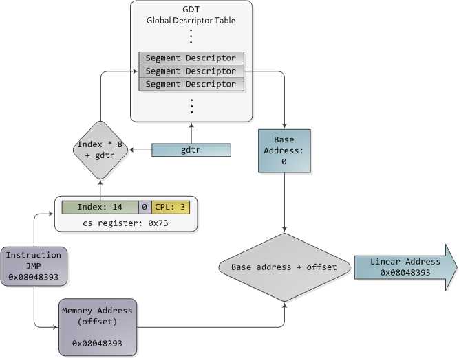

# Mode réel

En mode réel, il n'y a pas de segmentation ni de pagination : toute la ram est
utilisable librement, sans sécurité.

Puisque le mode réel est un "reste" des vieux ordinateurs 16bits, seuls deux
registres 16bits sont disponible pour faire de l'addressage. Il est donc possible 
d'utiliser au maximum `1Mio` (2^20 = 1024) adresses :

```
r1 * 0x10 = décalage d'un demin octet, 16 + 4 = 20 bits.
(r1 * 0x10) + r2 = adresse finale.
```

```
r1 = 0xFFFF
r2 = 0x000F

adresse = 0xFFFF0 + 0x000F
adresse = 0xFFFFF
```

+ Attention à l'overflow. 
+ Une même adresse peut être accèdée par différents couple base + offset.

# Mode protégé

En mode protégé, la segmentation a été mise en place : il s'agit de découper la
mémoire en morceaux accessibles uniquement parce les propriétaires et/ou le
système.

Un logiciel reçoit une zone mémoire de taille X qui sera découpé en section
code (pour les instructions), section de données (pour les données), section
de pile, de tables, \dots

Ce même logiciel utilisera un adresse logique, c'est à dire qu'elle peut exister
dans un autre logiciel :

+ thread_a : `mov eax, [0x22222222]`
+ thread_b : `mov ebx, [0x22222222]`

Il est clair que ces deux adresses ne pointent pas sur la même donnée. Pour ce
faire, il existe des registres de *selecteur de segment* qui permettent de
sélectionner le segment adéquat, prenons DS :

+ Il s'agit d'un registre 16 bits,
+ 13 bits constitue un `offset` dans un tableau
+ 1 bit signale si il s'agit de la GDT (Global Descriptor Table) ou la LDT
  (Local Descriptor Table),
+ et de 2 bits énumérant le `ring privilege` de 0 à 3 ( 4 rings ).

L'adresse du tableau LDT ou GDT se trouve dans le registre correspondant LDTR ou
GDTR.

Soient 

+ DS : `1001100101111 0 11`,
+ GDTR : `1001110110101101`

Prenons l'entrée de la table GDT en GDTR + DS[:13] * 8 (taille d'une entrée), 
cette entrée s'appelle un *descripteur de segment* et est composé de 64 bits(8octets) 
et possède (entre autre) l'adresse de base du segment de data ainsi que l'offset maximum.

Si 0x22222222 > offset maximum, l'addresse n'est pas valide. Si elle l'est,
l'adresse liénaire se trouve en base + adresse logique.




